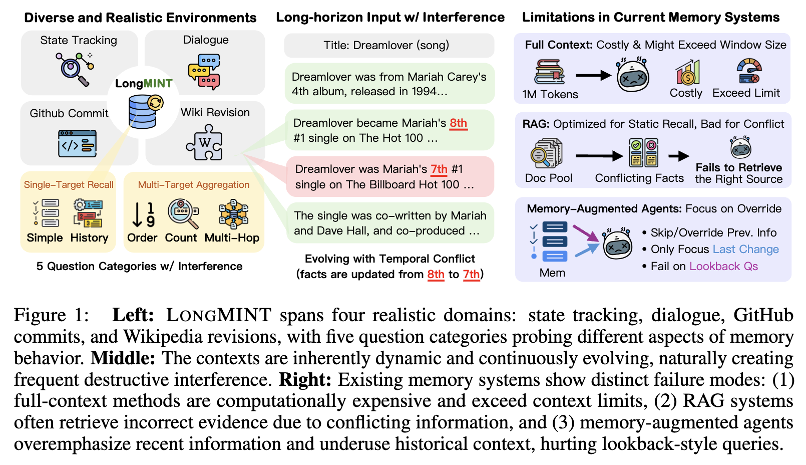

# MINTEval

Official implementation of **[MINTEval: Evaluating Memory under Multi-Target Interference in Long-Horizon Agent Systems](https://arxiv.org/abs/2605.18565)**.

[Hyunji Lee](https://amy-hyunji.github.io/) | [Justin Chih-Yao Chen](https://dinobby.github.io/) | [Joykirat Singh](https://joykirat18.github.io/) | [Zaid Khan](https://zaidkhan.me/) | [Elias Stengel-Eskin](https://esteng.github.io/) | [Mohit Bansal](https://www.cs.unc.edu/~mbansal/)


<p align="center">
  
</p>

---

## Overview

MINTEval is a benchmark for evaluating memory-augmented agents in continuously updated environments where they must process long contexts, recover earlier information, and reason over many updates that create interference between old and new information.

---

## Installation

### 1. Install dependencies for Full-Context, BaseRAG, and HippoRAG

```bash
pip install -r rag_requirements.txt
```

### 2. Install external baselines

Some baselines maintain their own environments and dependencies. Please follow the setup instructions in their official repositories:

- [Mem-alpha](https://github.com/wangyu-ustc/Mem-alpha)
- [MemAgent](https://github.com/BytedTsinghua-SIA/MemAgent)
- [AtomMem](https://github.com/RUCBM/AtomMem)

---

## Dataset

The MINTEval dataset is available on Hugging Face:

👉 [dinobby/MINTEval](https://huggingface.co/datasets/dinobby/MINTEval)

---

## Supported Baselines

| Method | Entry Point | Reference |
|---|---|---|
| **Full-Context** | `src/fullcontext/run_fullcontext_unified.py` | - |
| **BaseRAG** | `src/hipporag/tests_baserag.py` | - |
| **HippoRAG** | `src/hipporag/tests_hipporag.py` | [HippoRAG2](https://arxiv.org/abs/2502.14802) |
| **MemAgent** | `src/memagent/run_memagent_unified.py` | [MemAgent](https://arxiv.org/abs/2507.02259) |
| **AtomMem** | `src/atommem/run_atommem_unified.py` | [AtomMem](https://arxiv.org/abs/2601.08323) |
| **Mem-alpha** | `src/mem_alpha/run_memalpha_unified.py` | [Mem-alpha](https://arxiv.org/abs/2509.25911) |

---

## Quick Start

All runners expect a running **vLLM server**.

The default QA model used across scripts is:

```text
Qwen/Qwen3.6-35B-A3B
```

### 1. Start the QA model server

```bash
vllm serve Qwen/Qwen3.6-35B-A3B \
  --port 8001 \
  --tensor-parallel-size 2
```

### 2. Start backend-specific services (if required)

Some methods require additional services such as:

- Memory builders
- Embedding servers
- Retrieval backends

See the header comments in:

```bash
scripts/run_<backend>_all.sh
```

for backend-specific setup instructions.

### 3. Run experiments

Run a backend across all four datasets:

```bash
# Full-Context
./scripts/run_fullcontext_all.sh

# BaseRAG
./scripts/run_baserag_all.sh

# HippoRAG
./scripts/run_hipporag_all.sh

# MemAgent
./scripts/run_memagent_all.sh

# AtomMem
./scripts/run_atommem_all.sh

# Mem-alpha
./scripts/run_memalpha_all.sh
```

---

## Evaluation

### Evaluate a single result file

```bash
python eval.py --results src/mem_alpha/agents/<run>/0/results.json

python eval.py --results results/memagent/babi.jsonl
```

### Report performance by question category

```bash
python eval.py --results <file> --by-category
```

### Evaluate all result files in a directory

```bash
python eval.py --results results/memagent --by-dataset
```

---

## Acknowledgements

This repository builds on top of several excellent open-source projects and prior works:

* Datasets
- [Horizonbench](https://github.com/stellalisy/HorizonBench)
- [bAbI](https://arxiv.org/abs/1502.05698)
- [OAKS](https://github.com/kaistAI/OAKS)

* Baselines
- [HippoRAG](https://github.com/osu-nlp-group/hipporag) 
- [Mem-alpha](https://github.com/wangyu-ustc/Mem-alpha)
- [MemAgent](https://github.com/BytedTsinghua-SIA/MemAgent)
- [AtomMem](https://github.com/RUCBM/AtomMem)


We thank the authors for releasing their code and resources.

---

## Citation

If you find MINTEval useful, please cite our work:

```bibtex
@misc{lee2026mintevalevaluatingmemorymultitarget,
      title={MINTEval: Evaluating Memory under Multi-Target Interference in Long-Horizon Agent Systems}, 
      author={Hyunji Lee and Justin Chih-Yao Chen and Joykirat Singh and Zaid Khan and Elias Stengel-Eskin and Mohit Bansal},
      year={2026},
      eprint={2605.18565},
      archivePrefix={arXiv},
      primaryClass={cs.CL},
      url={https://arxiv.org/abs/2605.18565}, 
}
```

We also recommend citing the prior benchmark works and resources used in MINTEval:

```bibtex
@article{weston2015aicompleteqa,
      title={Towards AI-Complete Question Answering: A Set of Prerequisite Toy Tasks},
      author={Jason Weston and Antoine Bordes and Sumit Chopra and Alexander M. Rush and Bart van Merriënboer and Armand Joulin and Tomas Mikolov},
      year={2015},
      eprint={1502.05698},
      archivePrefix={arXiv},
      primaryClass={cs.AI},
      url={https://arxiv.org/abs/1502.05698},
}

@article{li2026horizonbench,
      title={HorizonBench: Long-Horizon Personalization with Evolving Preferences},
      author={Shuyue Stella Li and Bhargavi Paranjape and Kerem Oktar and Zhongyao Ma and Gelin Zhou and Lin Guan and Na Zhang and Sem Park and Lin Chen and Diyi Yang and Yulia Tsvetkov and Asli Celikyilmaz},
      year={2026},
      eprint={2604.17283},
      archivePrefix={arXiv},
      primaryClass={cs.CL},
      url={https://arxiv.org/abs/2604.17283},
}

@article{kim2026largelanguagemodelsup,
      title={Can Large Language Models Keep Up? Benchmarking Online Adaptation to Continual Knowledge Streams},
      author={Jiyeon Kim and Hyunji Lee and Dylan Zhou and Sue Hyun Park and Seunghyun Yoon and Trung Bui and Franck Dernoncourt and Sungmin Cha and Minjoon Seo},
      year={2026},
      eprint={2603.07392},
      archivePrefix={arXiv},
      primaryClass={cs.CL},
      url={https://arxiv.org/abs/2603.07392},
}

```
